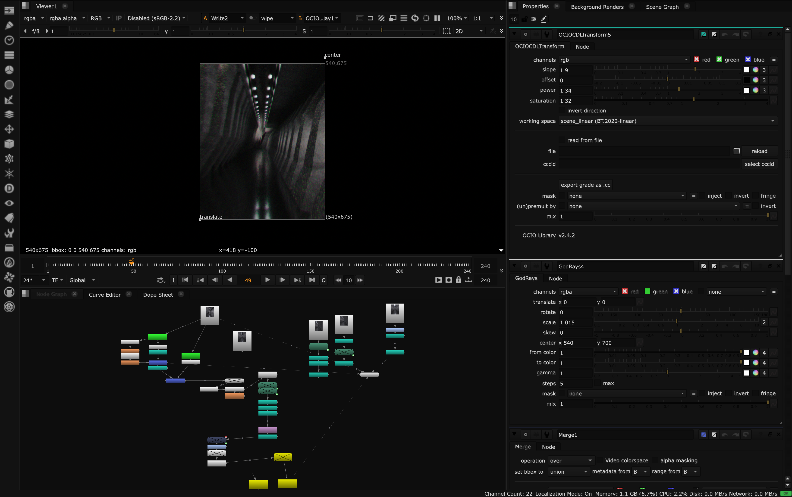

# EditorialDark

A clean, high-contrast dark palette for Nuke UI and node graph work.

## What It Does

This repo provides a custom dark look for Nuke by running `menu.py` at startup.

- Applies a dark UI palette for windows, panels, buttons, and text.
- Sets a darker DAG background.
- Improves node graph line and arrow visibility.
- Runs automatically on launch when installed in your `.nuke` folder.

## Setup

Copy this repo's `menu.py` into your Nuke user folder as `menu.py`.
If you already have a `menu.py`, merge the theme code into your existing file instead of overwriting it.

- macOS: `~/.nuke/menu.py`
- Linux: `~/.nuke/menu.py`
- Windows: `%USERPROFILE%\.nuke\menu.py`

After copying or merging, restart Nuke.

## Notes

- Paths can vary slightly depending on your Nuke install and user setup.
- To revert, remove or disable the theme code in `menu.py`, then restart Nuke.
